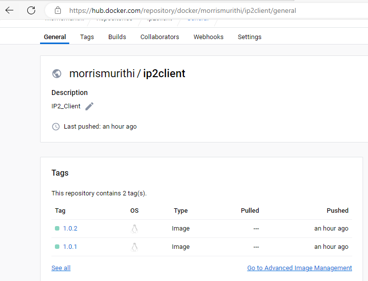

# Choice of the base image on which to build each container
- I used alpine linux based image because it offers the below;
  1. small image size
  2. Reduced attack surface
  3. Faster image builds
  4. Due to its small size and minimalist design, it will require and utilize less resources

# Dockerfile directives used in the creation and running of each container
 - These are as below;
  1. FROM : Base image that my container is built on
  2. WORKDIR : This will set the working directory inside the container where my commands will be executed
  3. COPY : Copies files or directories from your local file system into the container
  4. RUN :  Executes commands within the container during the image build process
  5. EXPOSE : Informs Docker that the container will listen on a specified network port at runtime
  6. CMD : Specifies the command to run when the container starts
  7. I would have used the ENV directive to set my environment but in this case I did not see the need to.

# Docker-compose Networking (Application port allocation and a bridge network implementation) where necessary
1. Port Allocation
  - In the ports directive, I have specified how my container ports are mapped to host ports. For example, 5000:5000   maps port 5000 in the container to port 5000 on the host for the backend service.
  - Similarly, 3000:3000 maps port 3000 in the container to port 3000 on the host for the frontend service.
2. Bridge Network Implementation
  - I created a custom bridge network called IP2-network using the networks section.
  - The driver: bridge specifies that it's a bridge network.
  - Both backend and client services are connected to this network using the networks directive within each service definition, my common network called IP2-network

# Docker-compose volume definition and usage (where necessary)
 1. Volume
  a.  Helpful for persisting and sharing data between containers or between containers and the host system. b.  Volumes can be used for various purposes, such as storing configuration files, databases, logs, or any data that needs to persist across container restarts.
2. Usage
 a. Manage & persist data in the containers
 b. File storage
 c. Configuration management
 d. Share data between containers e.g. Database and application

# Git workflow used to achieve the task
 1. git add . : To stage all my changes
 2. git status : To see my staged changes
 3. git commit -m : Commit the staged changes  with a commit message
 4. git push origin master : Push changes from my local branch to the remote main branch on the origin

# Successful running of the applications and if not, debugging measures applied
 1. Running my application
  - To run my application, I used the following commands
   a. docker-compose down
   b. docker system prune
   c. docker-compose -d
   e. docker ps -a
   f. npm start
2. Running comments
 a. I was able to run my application on the browser, however, on putting the products and refreshing, I could not find the products.
3. Debugging
 a. I tried to debug  this, though I know nothing about js, just research works.
 b. I found out that my client container was running and exiting, so the port was being assigned and within seconds, being exited, hence the reason the products could not persist
 c. I tried changing the ports of my network, rewriting the yaml file but I did not succeed in this.
 d. However, I got the skills and did everything else.

# Good practices such as Docker image tag naming standards for ease of identification of images and containers
 1. I used descriptive and meaningful naming conventions such as client and backend
 2. Use of lowercase letters to name my images for consistency and avoid potentialm issues on different platforms.
 3. Use of semantic versioning (Semver) for clarity on major, minor and features builds.
 4. Avoided using the name "Latest"  and instead used specific tags.
 5. Use of namespaces, morrismurithi

# Docker hub screenshots
morrismurithi/ip2backend

morrismurithi/ip2client

vscode-local:/c%253A/Users/Morris%2520Kinyua/Downloads/vertopal.com_morrismurithi_IP2_DockerHubs/b9fdc7dc3c2646cf9f45d40a3e9781b8.markdown

